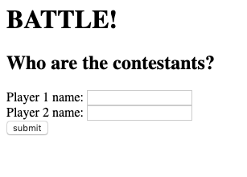
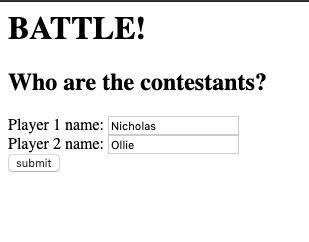
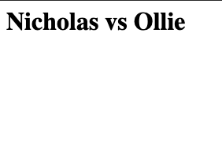
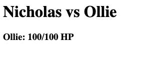
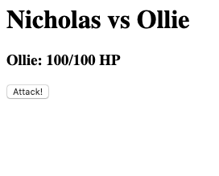
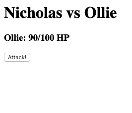

#BATTLE!

```
As two Players,
So we can play a personalised game of Battle,
We want to Start a fight by entering our names and seeing them
```

Object | Behaviours
-|-
Players  |  
Game  | input names







---

```
As Player 1,
So I can see how close I am to winning
I want to see Player 2's Hit Points
```



---

```
As Player 1,
So I can win a game of Battle,
I want to attack Player 2, and I want to get a confirmation
```

player 1 clicks attack
- in play.erb, a submit form called 'Attack'
- reduce p2hp in /attack and save to session variables
- redirects to /play

player 2 hp goes down by 10
- display /play with updated health (90)





---

```
As Player 1,
So I can start to win a game of Battle,
I want my attack to reduce Player 2's HP by 10
```

player 1 clicks attack
- in Player class, #attack is called with 1 argument (player 2)
-
- #attack reduces player 2's hitpoints by using player 2's hitpoint attr_writer

player 2 hp goes down by 10
